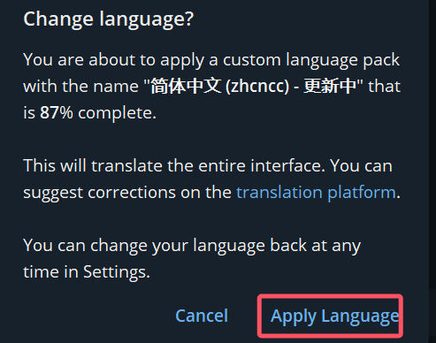
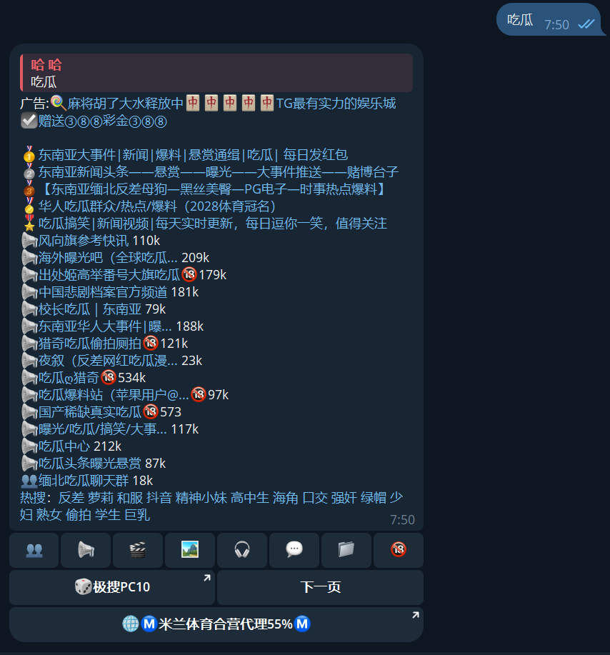

# 如何在telegram中使用极搜搜索

目前 telegram 开放了部分 +86 手机号注册，一些没有境外手机号的同学可以尝试注册了。但是 telegram 资源十分丰富，我们该如何在 telegram 中进行搜索呢？

这边文章教大家如何使用[极搜](https://t.me/jisou?start=a_1481769275)在 telegram 中进行搜索。

<!-- more -->

## telegram 官网下载地址

可以在 windows 商店中直接下载安装。点击 [这里](ms-windows-store://pdp?launch=true&mode=full&hl=zh-cn&gl=hk&ocid=bingwebsearch&referrer=storeforweb&productid=9nztwsqntd0s&storecid=sfw-secondary-cta&webid=395477ea-a7e6-4bfa-ac47-e06e900153a8&websessionid=9303d2ac-2b4a-48fc-b501-5acf807b00ed) 下载安装。

也可以从 telegram 官网下载：[telegram 官网](https://telegram.org/)

## telegram 注册方法

目前 telegram 开放了部分 +86 手机号注册，如果无法收到验证码或是无法注册，可以通过购买 eSIM 卡的方式来获取境外手机号进行注册。

要注意的是 **5ber疑似跑路**，购买后无法下载 eSIM 卡。建议购买5ber平替：9eSIM。具体方法大家感兴趣的话请留言，我后面单独出一篇攻略，这里就不多说了。

## telegram 汉化

点击这里：[telegram 一键汉化](https://t.me/setlanguage/zhcncc)。

跳转后点击`Apply Language`，即可完成汉化。

## 使用极搜搜索 telegram 资源

注册完成后，直接点击这个连接：[telegram极搜搜索](https://t.me/jisou?start=a_1481769275)

随后跳转到 telegram 中就可以进行搜索了！

## 注意！

因为境外平台对于内容监管力度不一，所以在 telegram 中搜索到的资源不一定是合法的，大家在使用的时候要注意！

同时在使用过程中也要注意保护自己的隐私安全，避免泄露个人信息。提高警惕，谨防诈骗。

如果有任何问题，欢迎在评论区留言，我会尽快回复大家的。