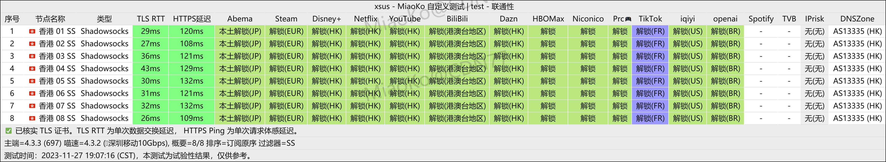

# 机场推荐【淘气兔】 - 高性价比、老牌机场

淘气兔机场，最低 7.8元 100G/月。老牌机场、稳定可靠、高性价比。

淘气兔官网地址：[https://taoqitu.uk](https://taoqitu.uk)

<!-- more -->

## 淘气兔 官网地址

[https://taoqitu.uk](https://taoqitu.uk)

## 淘气兔 机场简介

最便宜的订阅有7.8元 100G/月。

淘气兔机场是一家老牌机场，价格实惠，节点较多，节点质量也非常高，速度快，支持 Netflix、ChatGPT。

客服响应及时，强烈推荐这个机场。

## 淘气兔 机场测试

## 机场汇总

[https://jichangtuijian.uk/vpn/vpn.html](https://jichangtuijian.uk/vpn/vpn.html)

## 客户端使用方法

- 📱 [clash for Android](https://jichangtuijian.uk/article/clashforAndroid.html)
- 🖥 [clash for Windows](https://jichangtuijian.uk/article/clash.html)
- 🍎 [clash for IOS](https://jichangtuijian.uk/article/Shadowrocket.html)