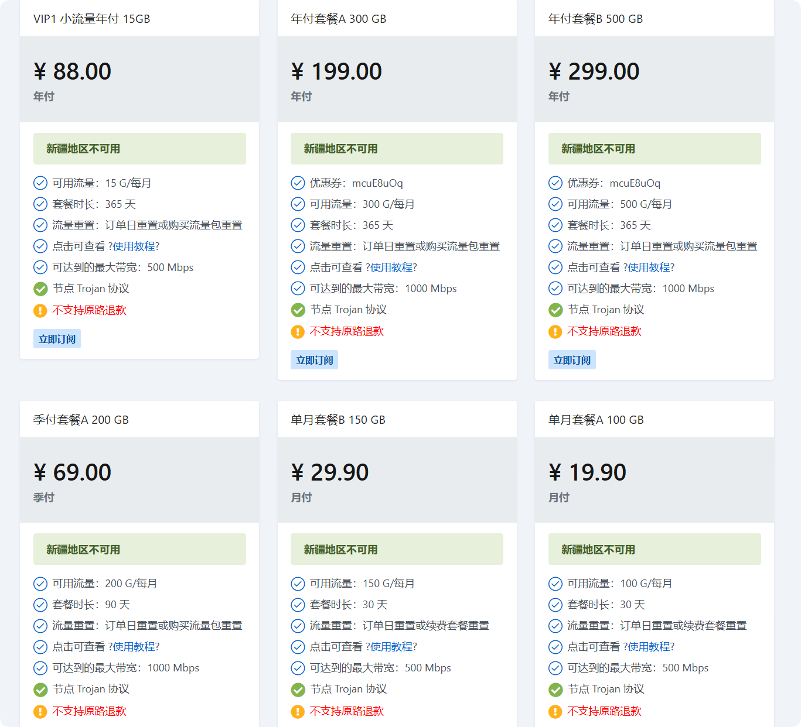
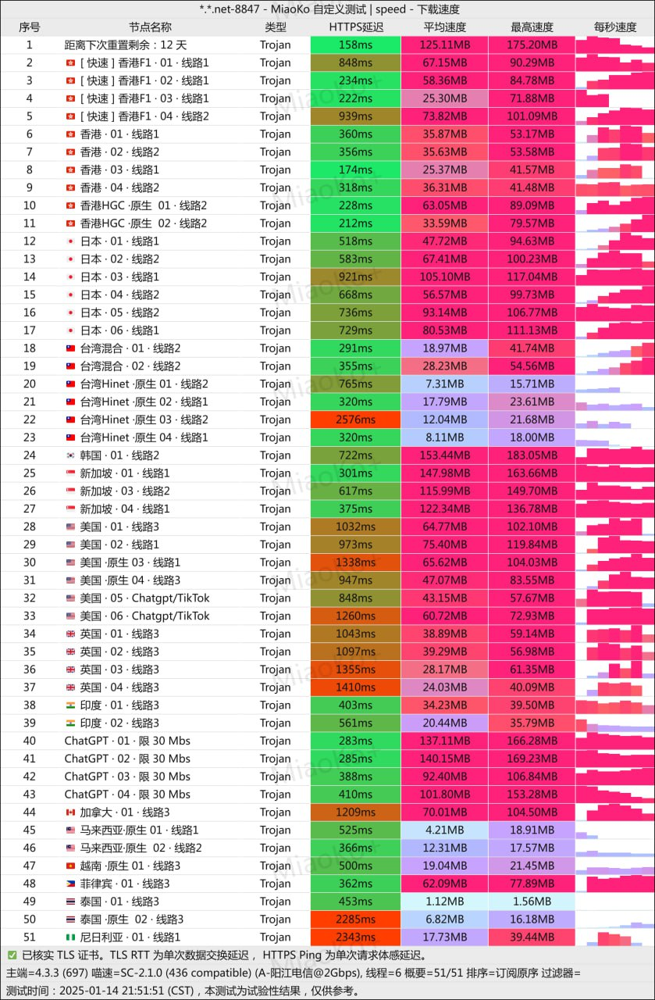

# 机场推荐【大哥云】 - 高性价比、老牌机场

大哥云机场，近期新上季付轻量包，专门为用量小的用户设计，19.9元/月。

## 大哥云官网地址

[https://www.dgywzc.com](https://www.dgywzc.com/#/register?code=JSSN0WQ9)

## 大哥云机场简介

最便宜的订阅有19.9元 100G/月。

大哥云机场5年老品牌，可以免费试用，支持奈飞等多家流媒体解锁，支持YOUTUBE 8K流畅观看支持IPLC线路。

## 大哥云机场测试

## 机场汇总

[https://jichangtuijian.uk/vpn/vpn.html](https://jichangtuijian.uk/vpn/vpn.html)

## 客户端使用方法

- 📱 [clash for Android](https://jichangtuijian.uk/article/clashforAndroid.html)
- 🖥 [clash for Windows](https://jichangtuijian.uk/article/clash.html)
- 🍎 [clash for IOS](https://jichangtuijian.uk/article/Shadowrocket.html)
