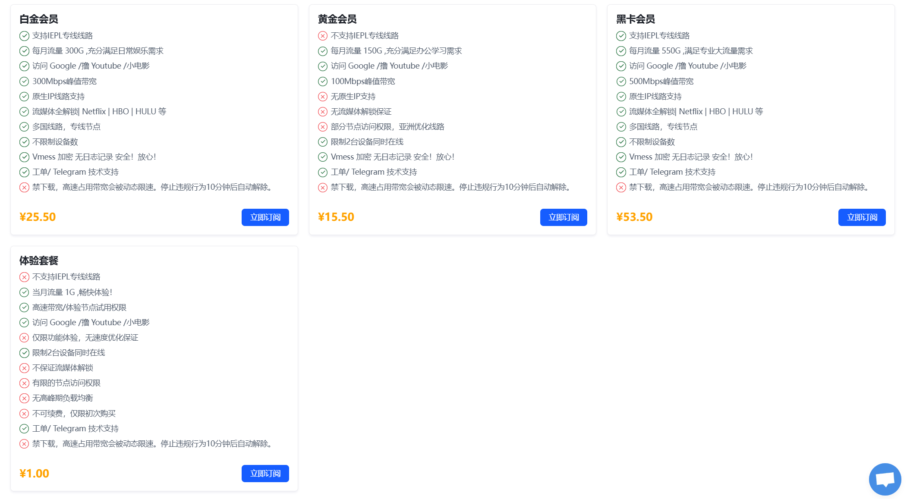

# 【机场推荐】老头VPN - 公认老牌机场、稳定实惠

老头VPN，15.5元 150G/月，公认老牌机场、稳定实惠。

老头VPN官网地址：[https://www.chattous.net](https://chattous.net/#/register?code=MAiRMtof)

<!-- more -->

## 老头VPN官网地址

[https://www.chattous.net](https://chattous.net/#/register?code=MAiRMtof)

## 老头VPN机场简介

[老头VPN](https://chattous.net/#/register?code=MAiRMtof)最便宜的机场订阅有15.5元 150G/月。从2016年开始运营至今，扎实可靠。各大流媒体均已解锁。

客服响应很快也足够专业。

## 老头VPN机场测试

## 机场汇总

[https://jichangtuijian.uk/vpn/vpn.html](https://jichangtuijian.uk/vpn/vpn.html)

## 客户端使用方法

- 📱 [clash for Android](https://jichangtuijian.uk/article/clashforAndroid.html)
- 🖥 [clash for Windows](https://jichangtuijian.uk/article/clash.html)
- 🍎 [clash for IOS](https://jichangtuijian.uk/article/Shadowrocket.html)
