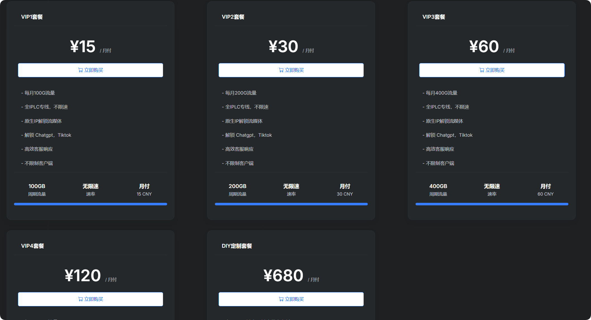

# ✈️机场推荐【龙猫云】 - 全IPLC专线、老牌机场

## 龙猫云官网地址

[https://hbhb11822.lmvipaff03.cc/](https://hbhb11822.lmvipaff05.cc/register?aff=n3wi2NwS)

## 龙猫云机场简介

最便宜的订阅有 15元 100G/月。

龙猫云情人节&开学季大促！

1-活动时间：即日起至2025年9月15号23点59分

2-月付/季度/半年 享受85折优惠，优惠码：kaixue85

3-年付/2年/3年 享受8折优惠，优惠码：kaixue80

**特性如下**

- 超高性价比，节点质量高，客服实时在线，晚高峰不限速，不限制设备。
- IPLC深港、沪美、沪日专线，
- 流媒体完美解锁（包括Netflix , Disney+, HBO等）
- 完美解锁ChatGPT、Gemini、Copilot
- 支持Tiktok本土短视频运营和直播

## 龙猫云机场测试

## 机场汇总

[https://jichangtuijian.uk/vpn/vpn.html](https://jichangtuijian.uk/vpn/vpn.html)

## 客户端使用方法

- 📱 [clash for Android](https://jichangtuijian.uk/article/clashforAndroid.html)
- 🖥 [clash for Windows](https://jichangtuijian.uk/article/clash.html)
- 🍎 [clash for IOS](https://jichangtuijian.uk/article/Shadowrocket.html)
