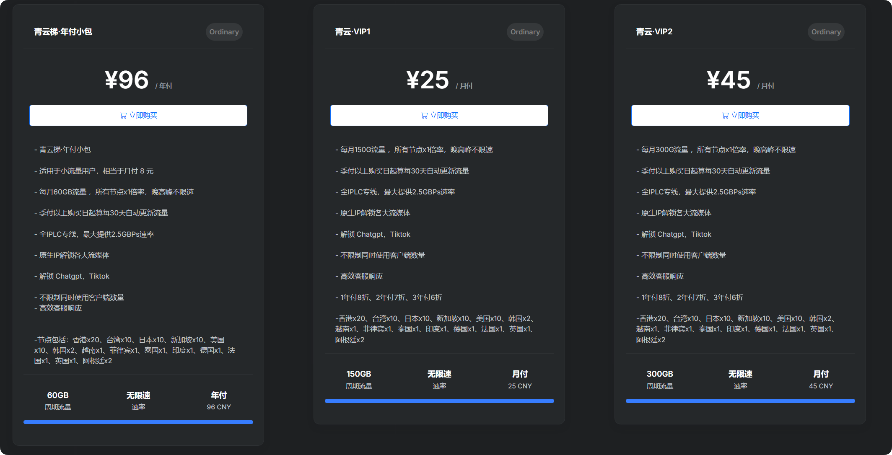

# ✈️机场推荐【青云梯】 - 高性价比、老牌机场

## 青云梯官网地址

[ivt01.qytvipaff.cc](https://ivt01.qytaff.cc/register?aff=dTvJ05CM)

## 青云梯机场简介

最便宜的订阅有 8元 60g/月(年付)。

五年老牌机场，常年稳定运行，解锁Chatgpt，Tiktok及各大流媒体，IPLC专线节点，不限制同时使用客户端数量，高效客服响应，支持支付宝支付。

## 青云梯机场测试

### 青云梯入口测试

### 青云梯电信测试

### 青云梯移动测试

### 青云梯联通测试

## 机场汇总

[https://jichangtuijian.uk/vpn/vpn.html](https://jichangtuijian.uk/vpn/vpn.html)

## 客户端使用方法

- 📱 [clash for Android](https://jichangtuijian.uk/article/clashforAndroid.html)
- 🖥 [clash for Windows](https://jichangtuijian.uk/article/clash.html)
- 🍎 [clash for IOS](https://jichangtuijian.uk/article/Shadowrocket.html)
