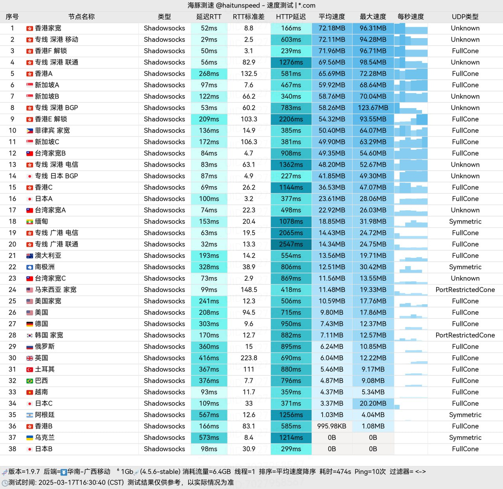

# ✈️机场推荐【纵云梯】 - 新机场、节点通畅

纵云梯机场是一个全自研开发平台，台湾家宽，隧道晚高峰自动切BGP入口、三网专线、GPT不降智。累计消费最高可以享七五折。

纵云梯官网地址：[https://zongyunti.com/](https://c.jichangs.com/node1)

### 纵云梯官网地址

[https://zongyunti.com/](https://c.jichangs.com/node1)

### 纵云梯机场简介

[纵云梯](https://c.jichangs.com/node1)网络加速服务采用最先进的加密技术，保障您的网络安全与隐私。

#### 高速稳定

[纵云梯](https://c.jichangs.com/node1)服务器分布全球各地，保证您在任何时间、任何地点都能享受到流畅的网络体验。

#### 简单易用

[纵云梯](https://c.jichangs.com/node1)提供适配市面上主流的客户端订阅，让您一键连接，轻松畅游互联网。

#### 全自研开发

[纵云梯](https://c.jichangs.com/node1)所有技术均为自主研发，确保高效、安全和持续创新。

#### 海外团队运营

[纵云梯](https://c.jichangs.com/node1)由全球各地的运营团队提供支持，确保无忧的服务体验。

#### 直连线路

[纵云梯](https://c.jichangs.com/node1)直连海外，确保数据传输的高速与稳定，减少延迟。

#### 中转线路

[纵云梯](https://c.jichangs.com/node1)通过国内入口到达海外服务器，优化跨境访问体验。

#### 专线线路

[纵云梯](https://c.jichangs.com/node1)提供IEPL专线线路，确保网络的质量与稳定。

### 纵云梯机场测试

## 机场汇总

[https://jichangtuijian.uk/vpn/vpn.html](https://jichangtuijian.uk/vpn/vpn.html)

## 客户端使用方法

- 📱 [clash for Android](https://jichangtuijian.uk/article/clashforAndroid.html)
- 🖥 [clash for Windows](https://jichangtuijian.uk/article/clash.html)
- 🍎 [clash for IOS](https://jichangtuijian.uk/article/Shadowrocket.html)
