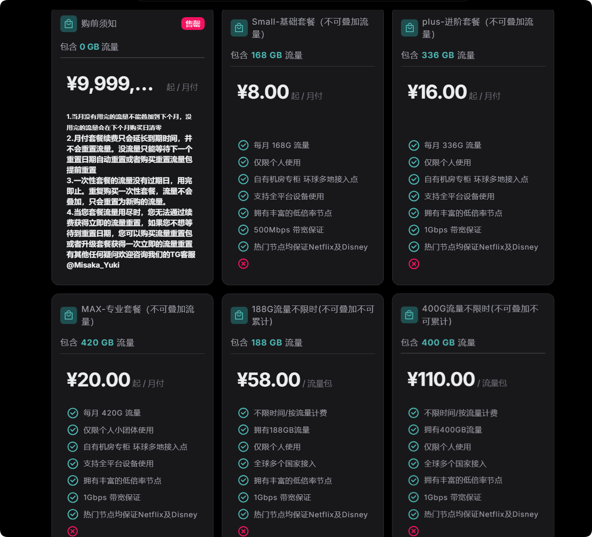
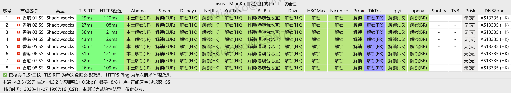

xsus机场，最低 8元 168G/月。老牌机场、稳定可靠、高性价比。

xsus官网地址：[https://xs-us.xyz](https://xs-us.xyz/register?code=xJFcT1Dw)

<!-- more -->

## XSUS 官网地址

[https://xs-us.xyz](https://xs-us.xyz/register?code=xJFcT1Dw)

## XSUS 机场简介

最便宜的订阅有8元 168G/月。

XSUS 机场是一家老牌机场，价格实惠，节点较多，节点质量也非常高，速度快，支持 Netflix、ChatGPT。

客服响应及时，强烈推荐这个机场。

## XSUS 机场测试

## 机场汇总

[https://www.ermao.net/posts/vpn](https://www.ermao.net/posts/vpn)

## 客户端使用方法

- 📱 [clash for Android](https://www.ermao.net/article/eh8f4n86/)
- 🖥 [clash for Windows](https://www.ermao.net/article/0gematwc/)
- 🍎 [clash for iOS](https://www.ermao.net/article/z747kgjd/)