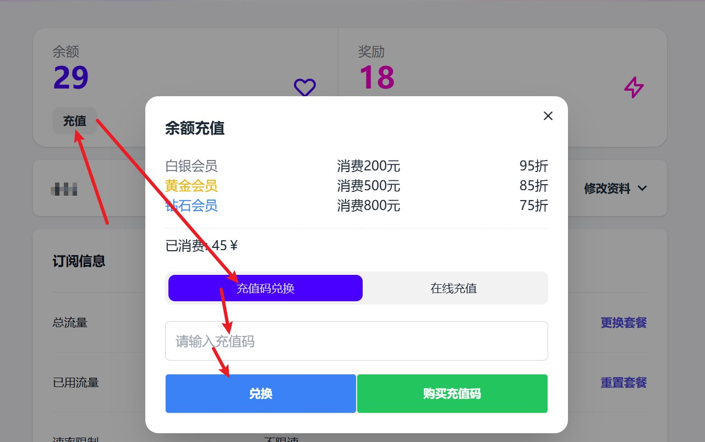
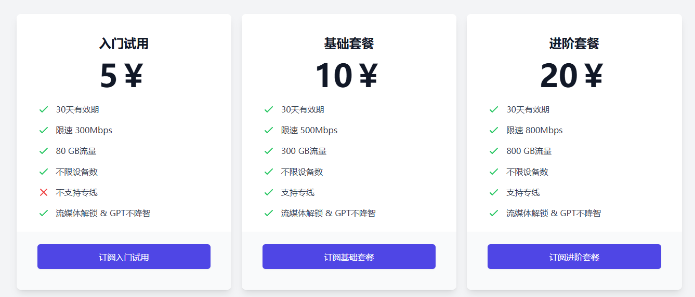
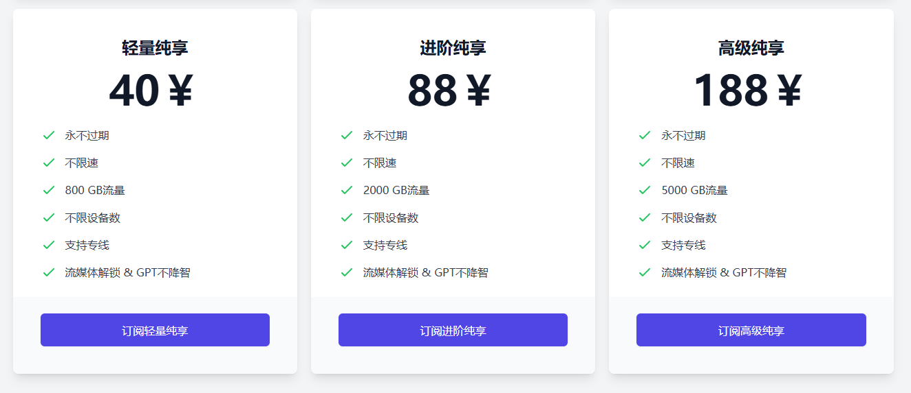
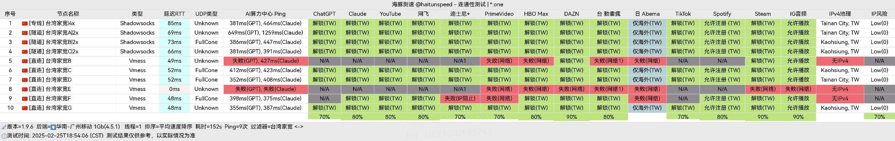
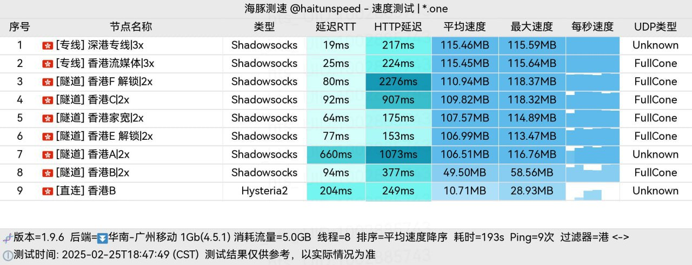
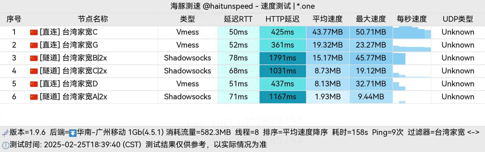

冲上云霄是一个全自研开发平台，台湾家宽，隧道晚高峰自动切BGP入口、三网专线、GPT不降智。累计消费最高可以享七五折。

冲上云霄优惠码：`ermaozi` 购买套餐后使用此优惠码可以获得 20G 流量。

冲上云霄官网地址：[https://cpdd.one](https://cpdd.one/?r=32083)

<!-- more -->

### 冲上云霄机场简介

[冲上云霄](https://cpdd.one/?r=32083)优惠码：`ermaozi` 购买套餐后使用可以获得 20G 流量。

[冲上云霄](https://cpdd.one/?r=32083)是一个全自研开发平台，台湾家宽，隧道晚高峰自动切BGP入口、三网专线、GPT不降智。

累计消费最高可以享七五折。

最便宜的订阅有 5元 80G/30天。

### 冲上云霄机场测试

#### 流媒体

#### 香港

#### 新加坡

#### 台湾

#### 日本

## 机场汇总

[https://www.ermao.net/posts/vpn](https://www.ermao.net/posts/vpn)

## 客户端使用方法

- 📱 [clash for Android](https://www.ermao.net/article/eh8f4n86/)
- 🖥 [clash for Windows](https://www.ermao.net/article/0gematwc/)
- 🍎 [clash for iOS](https://www.ermao.net/article/z747kgjd/)